# ToolAndCommand-VSCode

## Extensiones Grals de VSCode

|Extension|Plataformas|Configuracion|Descripcion
|---|---|---|---|
| [Activitus Bar](https://marketplace.visualstudio.com/items?itemName=Gruntfuggly.activitusbar)|**`All`**|""|""|  
| [Color Highlight](https://marketplace.visualstudio.com/items?itemName=naumovs.color-highlight) | **`All`** | "" | "" |
| [Peacock](https://marketplace.visualstudio.com/items?itemName=johnpapa.vscode-peacock) | **`All`** | "React Blue" | "" |
| [C#](https://github.com/OmniSharp/omnisharp-vscode/issues/1585) | **`.Net Core`** | "" | "" |
| [Community Material Theme](https://marketplace.visualstudio.com/items?itemName=Equinusocio.vsc-community-material-theme) | **`Not Defined`** | "" | "" |
| [Material Icon Theme](https://marketplace.visualstudio.com/items?itemName=PKief.material-icon-theme) | **`Not Defined`** | "" | "" |
| [Monokai Night Theme](https://marketplace.visualstudio.com/items?itemName=fabiospampinato.vscode-monokai-night) | **`NodeJs`** | "Dark" | "" |
| [Paste JSON as Code](https://marketplace.visualstudio.com/items?itemName=quicktype.quicktype) | **`All`** | "" | "" |
| [Terminal](https://marketplace.visualstudio.com/items?itemName=formulahendry.terminal) | **`All`** | "" | "" |
| [vscode-icons](https://marketplace.visualstudio.com/items?itemName=vscode-icons-team.vscode-icons) | **`.Net Core`** | "" | "" |
| [Liveserver](https://marketplace.visualstudio.com/items?itemName=ritwickdey.LiveServer) | **`NodeJs`** | "" | "" |
| [Jest](https://marketplace.visualstudio.com/items?itemName=Orta.vscode-jest) | **`NodeJs`** | "" | "" |
| [TODO Tree](https://marketplace.visualstudio.com/items?itemName=Gruntfuggly.todo-tree) | **`Not Defined`** | "" | "" |
| [Bookmarks](https://marketplace.visualstudio.com/items?itemName=alefragnani.Bookmarks) | **`Not Defined`** | "" | "" |
| [TODO Highlight](https://marketplace.visualstudio.com/items?itemName=wayou.vscode-todo-highlight) | **`Not Defined`** | "" | "" |
| [Bracket Pair Colorizer 2](https://marketplace.visualstudio.com/items?itemName=CoenraadS.bracket-pair-colorizer-2) | **`Not Defined`** | "" | "" |
| [Color Highlight](https://marketplace.visualstudio.com/items?itemName=naumovs.color-highlight) | **`Not Defined`** | "" | "" |
| [Visual Studio 2019 Theme](https://marketplace.visualstudio.com/items?itemName=kast789.vs-2019-theme) | **`.Net Core`** | "Dark" | "" |
| [GitLens — Git supercharged](https://marketplace.visualstudio.com/items?itemName=eamodio.gitlens) | **`All`** | "Disable" | "Solo activarla cuando se requiera para no consumir recursos de mas" |
| [SQL Server (mssql)](https://marketplace.visualstudio.com/items?itemName=ms-mssql.mssql) | **`.Net Core`** | | |
| [Bootstrap And CSS Autocomplete (mssql)]([https://marketplace.visualstudio.com/items?itemName=ms-mssql.mssql](https://marketplace.visualstudio.com/items?itemName=hossaini.bootstrap-intellisense) | **`Bootstrap All Version and CSS`** | | |

## Software de ayuda para programar

|Extension|Plataformas|Configuracion|Descripcion
|---|---|---|---|
| [Color Picker Tools PRO](https://www.microsoft.com/store/productId/9P744VBBPXM1?ocid=pdpshare)|**`Colors CSS`**|""|""|  

## Comandos y puntos pendientes a buscar.

- Comando para que la barra lateral Izquierda se oculte cuando pongo el cursor en el editor de codigo.

- Snipped que cuando me ponga caracteres en una determinada longitud (ruler) de la linea de codigo.

- https://nodatime.org/  libreria para trabajar con fechas en .net core

## Extensiones generales recomendadas basadas en el siguiente repo [Codifica mas rapido por Fernando Herrera](https://github.com/CesarLuilly/curso-VSCode)

## Estensiones para Visual Studio
https://www.youtube.com/watch?v=aLhwWwVQUCQ

- Productivity Power Tools installation [03:30]
- Align Assignments [12:00]: Aligns assignment statements by typing Ctrl+Alt+] 
- Copy As Html [13:35]: Provides support for the HTML Clipboard format when cutting for copying code from the editor
- Ctrl+Click GoTo Definition [15:40]: Enables clickable hyperlinks to symbols in source code in your code by holding down the Ctrl key when hovering with the mouse
- Custom Document Well [18:45]: Allows users to change the behavior of their document tabs 
- Double-Click Maximize [22:00]: Maximize any docked window by double-clicking its title bar and restore/dock by double-clicking again 
- Editor Guidelines [22:45]: Draws a vertical line in the code editor to remind developers that their full line of code or comments may not fit one a single screen 
- Fix Mixed Tabs [25:25]: Helps to manage the whitespace inside your document and assists in keeping consistency in the use of tabs and spaces 
- Match Margin [28:10]: Highlights all the textual matches of token at the caret location in the Editor 
- Middle-Click Scroll [29:08]: Enables you to press down on your scroll wheel and move the mouse to quickly scroll through your document 
- Peek Help [30:05]: Brings up the F1 Help content inline in the editor 
- Power Commands for Visual Studio [31:40]: A set of useful extensions for the Visual Studio IDE, including Remove and Sort Usings, Copy Path and Open Command Prompt 
- Quick Launch Tasks [34:40]: Provides easy access to commonly used options (EG: toggling line numbers) as well as popular functionality (EG: collapsing/expanding regions)   
- Shrink Empty Lines [36:15]: Shrinks lines that contain neither letters nor numbers by 25% vertically, allowing more lines to be displayed in the editor 
- Solution Error Visualizer [38:00]: Adds error, warning, and message squiggles to Solution Explorer 
- Time Stamp Margin [40:25]: Adds the timestamp information to the Output Window in Debug mode
## Extensiones para .NetCore

* [C# Version 1.24.4 o 1.23.17 para .netCore 3](https://marketplace.visualstudio.com/items?itemName=ms-dotnettools.csharp) Nota. Con esta version te de muchas herramientas para programar en .Net Core, pero algunas versiones como la 1.25.0 no funcionan bien, por eso hay que probar, y lo mas facil para probar es yendo a un metodo y presionar F12 o alt+f12, si este funciona quiere decir que la version si esta funcionando bien. **Tambien dependiendo de la version de .netCore 3, 3.1, 5, 6 es la version de C# que se va a instalar**

***
Para que se pueda realizar el autocompletado hay que realizar la siguiente configuracion.
> 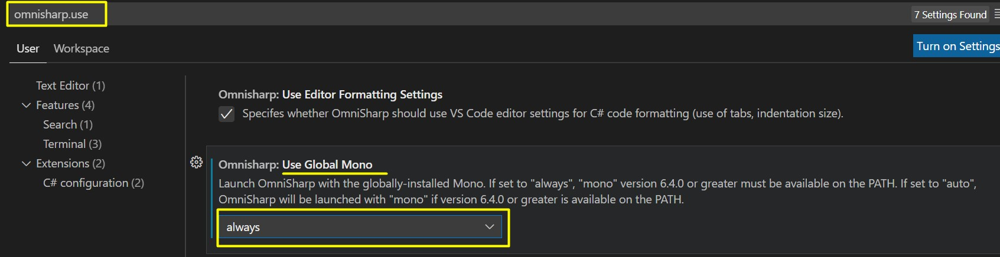
Algunas otras configuraciones recomendadas
> 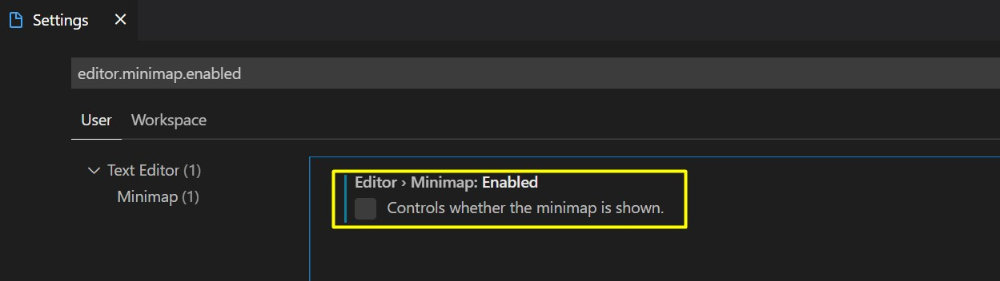
> 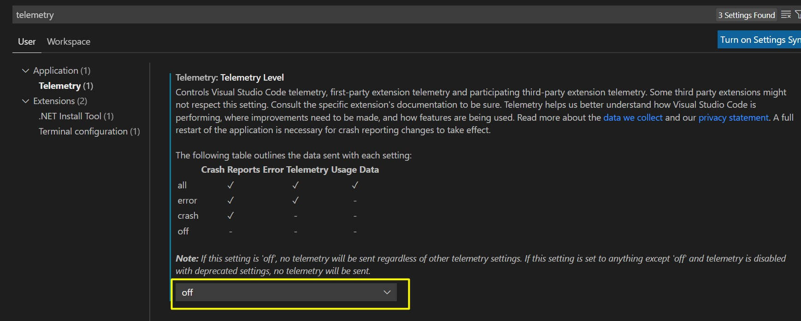
> 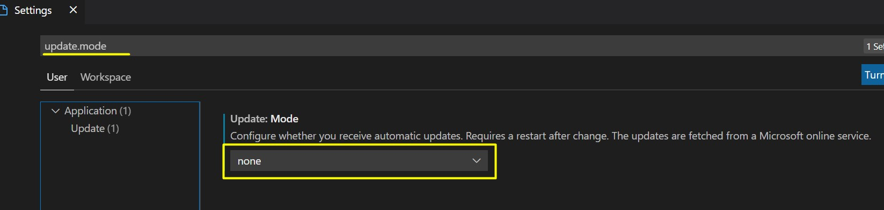
> 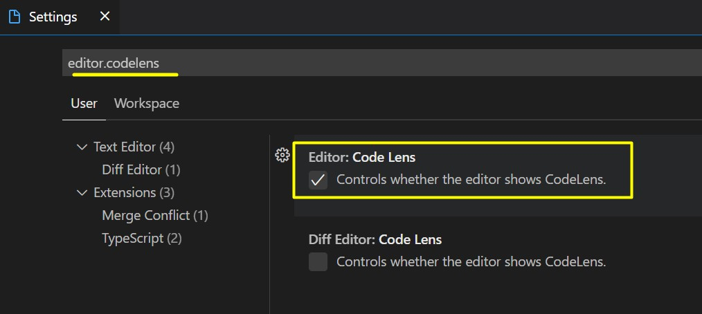
> 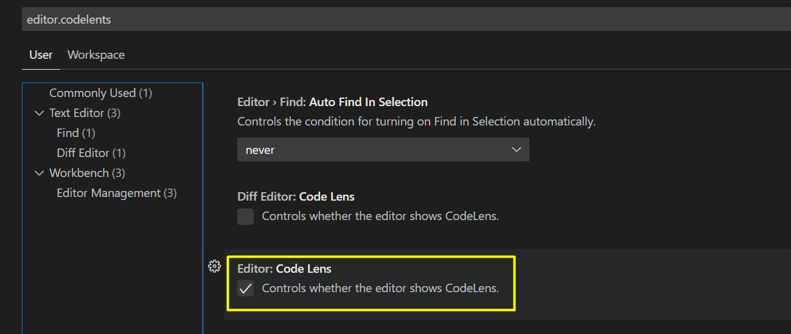
[Basado en el video](https://www.youtube.com/watch?v=jPTSLuluk8c&t=10s)
***

## Abrir rapido un proyecto .Net Core recien clonado en VS Code.

* Abrir una consola de comandos y limpiar la solucion con `dotnet clean`
* Ejecutar el comando `dotnet build`
* Abrir la carpeta con VS Code donde se encuentra la solucion del proyecto.
* Abrir el panel de comandos con `Ctrl+Shift+P` y buscar **omnisharp restart** (cuando termine de reiniciar aparecera un msj `Update project: Odyssey2Backend` hasta el ultimo en la consola de output con la opcion de `OmniSharp Log`)
* Volvemos a abrir el panel de comandos y buscamos `Omnisharp Analize Current Project` y le clickeamos para analizar el proyecto

## Comandos para .Net Core
* dotnet build
* dotnet run
* dotnet watch run

## Instalaciones necesarias para cubrir NodeJS de Udemy por Fernando Herrera.

* [NodeJs](https://gist.github.com/Klerith/177c153db77e566cb763f79e65d248bf)

## Instalaciones necesarias para cubrir Angular de cero a experto de Udemy por Fernando Herrera.
[Angular](https://gist.github.com/Klerith/607dd6bb60b5a70bc5e4d9c81ef6501e)

## Atajos de Window
| # | Comando | Descripcion | Comentario |
|:---:|:---:|:---:|:---:|
| 1 | Shift+F10 | Comando `ContextMenu` |


## Atajos de Visual Studio
Los comandos tambien se pueden econtrar en la siguiente liga.

[Comandos de Visual Studio 2022](https://docs.microsoft.com/es-es/visualstudio/ide/default-keyboard-shortcuts-in-visual-studio?view=vs-2022)


| # | Comando | Descripcion | Comentario |
|:---:|:---:|:---:|:---:|
| 1 | Shift+F10 + L | Limpia la consola de Output |

## Comandos para codificar mas rapido en VSCode

### Atajos Generales
| # | Comando | Descripcion | Comentario |
|:---:|:---:|:---:|:---:|
| 1 | Ctrl+K Ctrl+O | Abrir nueva instancia para trabajar |
| 2 | Ctrl+Shift+P ó F1 | Mostrar paleta de comandos |
| 3 | Ctrl+Shift+N | Nueva instancia de VSCode |
| 4 | Ctrl+N | Nueva pestaña |
| 5 | Ctrl+W | Cerrar Ventana |
| 6 | Ctrl+B | Visualiza/Ocultar Sidebar de VSCode |
| 7 | Ctrl+Shift+Y | Abrir consola de Debug |
| 12 | Ctrl+Shift+M | Abrir consola de problemas |
| 12 | Ctrl+Shift+U | Abrir consola de Output |
| 7 | Ctrl+Ñ | Abrir consola de Terminal |
| 8 | Ctrl+Shift+Ñ | Abrir nueva terminal |
| 9 | Alt+Z | Acortar el ancho de texto de VSCode para que aparescan en multilinea |
| 10 | Ctrl+Shift+V | Markdown preview |
| 11 | Ctrl + K V | Markdown preview (a lado) |
| 12 | Ctrl + K Ctrl + S | Ver atajos de teclado |
| 13 | Ctrl + , | Configuracion del editor |
| 14 | Abrir paleta comandos y Teclear "Folder" | Collapsar todos las carpetas |
| 15 | Ctrl+Ship+p y tecleamos `Reload window` | Recargar visual studio code |
| 15 | Ctrl+Delete | Borra del punto actual hasta la proxima palabra de atras |

### Relacionados Multicursores
| # | Comando | Descripcion | Comentario |
|:---:|:---:|:---:|:---:|
| 1 | Alt+Click | Insertar cursor |
| 2 | Ctrl+Alt+↓/↑ | Insertar cursor arriba o abajo |
| 3 | Ctrl+U | Deshacer cursor |
| 4 | Ctrl+Shift+L | Poner cursores en todas las coincidencias |
| 5 | Ctrl+D | Buscar siguiente ocurrencia y poner cursor |
| 6 | Shift+Alt+Arrastrar | Seleccion de columnas y poner cursores|

### Seleccion
| # | Comando | Descripcion | Comentario |
|:---:|:---:|:---:|:---:|
| 1 | Ctrl+A | Seleccionar todo el texto |
| 2 | Ctrl+L | Seleccionar linea actual |
| 3 | Shift+Alt+ ← / → | Expandir o reducir seleccion |

### Manejo del codigo
| # | Comando | Descripcion | Comentario |
|:---:|:---:|:---:|:---:|
| 1 | Alt + ↓/↑ | Mover linea de codigo |
| 2 | Shift + Alt + ↓/↑ | Copiar linea de codigo|
| 3 | Ctrl+Enter | Agregar nueva linea abajo |
| 4 | Ctrl+Shift+Enter | Agregar nueva linea arriba |
| 5 | Ctrl+Shift+K | Borrar linea linea de codigo |
| 6 | Ctrl+Shift+\ | Navegar al cierre actual |
| 7 | Ctrl + Home / End | Ir al inicio o final de un archivo |
| 8 | Ctrl+K Ctrl+C | Comentar |
| 9 | Ctrl+K Ctrl+U | Descomentar |
| 10 | Shift+Alt+A | Comentar o descomentar bloque de codigo |
| 11 | Ctrl+. | Ver diferentes tips que da VSCode |
| 12 | Ctrl + ↓/↑ | Desplazar el archivo hacia arriba o abajo |
| 13 | Ctrl+K Ctrl+F | Darle formato a la seleccion que se iso (Acomodar llaves, parentesis, etc) |

### Manejo del editor y Edicion
| # | Comando | Descripcion | Comentario |
|:---:|:---:|:---:|:---:|
| 1 | Ctrl+Alt+→ | Dividir pantalla en 2 o mas vistas |
| 2 | Ctrl+1, 2, 3 | Moverse entre los grupos de pantalla |
| 3 | Shift+Alt+0 | Cambiar la orientacion de las pantallas |
| 4 | F11 | Pantalla completa |
| 5 | Ctrl+Shift+E | Mostrar el explorador de archivos del sidebar |
| 6 | Ctrl+Shift+F | Mostrar el buscador del sidebar para buscar en todo la solucion |
| 7 | Ctrl+Shift+D | Mostrar Debug |
| 8 | Ctrl+Shift+X | Mostrar Extensiones |
| 9 | Ctrl+K  Z | Modo Zen(Sin distracciones) |
| 10 | Ctrl+H | Reemplazar |
| 11 | Tab ó Shift + Tab | Identar codigo |
| 12 | Ctrl+Z | Revertir cambios |
| 13 | Ctrl+Shift+Z ò Ctrl+Y | Recuperar los ultimos cambios revertidos |
| 14 | F2 | Replace/Renombrar | Hay que tener mucho cuidado y ver que es lo que hace y como afecta a otros archivos. **Nota**: Los archivos que se ven modificados por es15 renombramiento, se abren en automatico en VSCode para despues verificar esos cambios | 
| 16 | Ctrl+Shift+P "wrapt" | Encerrar un texto en etiqueta personalizada |

### Relacionados consulta de archivos o informacion
| # | Comando | Descripcion | Comentario |
|:---:|:---:|:---:|:---:|
| 1 | Ctrl+G | Ir a una linea determinada de codigo |
| 2 | F12 | Ir a la definicion de la clase |
| 3 | Alt+F12 | Mostrar pequeña ventana de definicion de la clase |
| 4 | Shift+F12 | Mostrar todas las referencias de algun metodo, clase, variable |
| 5 | Ctrl+P | Buscar archivos |
| 6 | Ctrl+Shift+O | Busca todas las propiedades y metodos de la clase |
| 7 | Ctrl+Shift+O : | Agrupamos todas las propiedades y metodos de la clase |
| 8 | Ctrl+T | Buscar entre los metodos de toda la solucion |
| 9 | Ctrl+Shift+. | Ver todos los metodos de un archivo |
| 10 | Ctrl+F | Buscar en el documento actual |
| 11 | F3 ò Shift+F3 ó Enter ó Shift+Enter | Siguiente/Anterior busqueda |
| 12 | Alt+Enter | Poner cursor en todas las ocurrencias de la busqueda |

### Manejo de archivos
| # | Comando | Descripcion | Comentario |
|:---:|:---:|:---:|:---:|
| 1 | Ctrl+O | Abrir archivo |
| 2 | Ctrl+K S | Guardar todo|
| 3 | Ctrl+K Ctrl+W | Cerrar todos los tabs |
| 4 | Ctrl+Shift+T | Reabrir la ultima pestaña cerrada |
| 5 | Ctrl+Tab ó Ctrl+Shift+Tab| Cambiar de tab |
| 6 | Ctrl+K Ctrl+ ← / →  ò Ctrl + numero | Moverse entre pestañas |
| 7 | Ctrl+K P| Copiar ruta actual |
| 8 | Ctrl+K R| Abrir el archivo actual en el finder o explorator |
| 9 | Ctrl+K O| Abrir archivo actual en una nueva ventana o instancia |

### Debugging
| # | Comando | Descripcion | Comentario |
|:---:|:---:|:---:|:---:|
| 1 | F9 | Poner Breakpoint |
| 2 | F5 | Continue / Pause |
| 3 | F10 | Step Over |
| 4 | F11| Step Into |
| 5 | Shift+F11| Step Out |
| 6 | Ctrl+Shift+F5| Restart |
| 7 | Shift+F5| Stop |

### Comandos personalizados
| # | Keybinding | Descripcion | Command | when |
|:---:|:---:|:---:|:---:|:---:|
| 1 | Ctrl+Shift+Ñ | Maximizar y minimizar la consola de comandos | "workbench.action.toggleMaximizedPanel" | terminalProcessSupported \|\| terminalWebExtensionContributedProfile |
| 2 | Ctrl+K | Limpiar la consola de comandos | "workbench.action.terminal.clear" | "terminalFocus" | 
| 3 | Ctrl+K | Limpiar la consola de debug | "workbench.debug.panel.action.clearReplAction" | "inDebugRepl" | 
| 4 | Alt+Q | Mostrar u ocultar el panel inferior | View: Toggle Panel Visibility | "-" | 
| 5 | Ctrl+Alt+N | Mover el sidebar a la Izquierda | "workbench.action.moveSideBarLeft" | "-" | 
| 6 | Ctrl+Alt+M | Mover el sidebar a la Derecha | "workbench.action.moveSideBarRight" | "-" | 

Tomando como referencia **https://filisantillan.com/blog/vscode-atajos/**

## Docker para .Net Core

> Iniciamos PowerShell de Windows.

|#| Comando | Descripcion |
|:---:|:---:|:---:|
| 1 | docker | Ver version |
| 2 | docker image ls | Ver las imagenes Docker |
| #|  | Nota. Para .Ner Core 3 Se necesitan descargar las img base |


## Comandos de SO Window
| # | Comando | Descripcion |
|:---:|:---:|:---:|
| 1 | Window+Espacidora | Cambiar idioma de teclado |

## Snippets
Ir a File/Preference/User Snippets/"Seleccionamos el lenguaje"
### Javascript
```
"mostrar log": {
    "prefix": "clg",
    "body": [
        "console.log(${1:\"Hola mundo\"});",
        "$2"
    ],
    "description": "Mostrar el log en la o consulta"
},
"comments": {
    "prefix": "//",
    "body": [
        "//  //$1"
    ],
    "description": "comments"
},
"Separador de ejemplos": {
    "prefix": "clgseparador",
    "body": [
        "console.log(\"Example ${1:1}************************************\");",
        "$0"
    ],
    "description": "comments"
}
```
### Typescript
```
"mostrar log": {
    "prefix": "clg",
    "body": [
        "console.log(${1:'Hola mundo'});",
        "$2"
    ],
    "description": "Mostrar el log"
},
"mostrar clase": {
    "prefix": "clase",
    "body": [
        "export class ${1:SuperHeroe} {",
        " ",
        "\tconstructor() {",
        "\t//\tholamundo$2",
        "\t}",
        "}"
    ],
    "description": "Mostrar clase"
},
"mostrar todo": {
    "prefix": "todo",
    "body": [
        "// TODO: ",
    ],
    "description": "Mostrar Todo"
},
"mostrar fixme": {
    "prefix": "fixme",
    "body": [
        "// FIXME: ",
    ],
    "description": "Mostrar fixme"
}
```

### TW C#
```json
"tw line class": {
    "prefix": "twLineClass",
    "body": [
        "//==================================================================================================================",
        "$2"
    ],
    "description": "standart"
},
"tw line method": {
    "prefix": "twLineMethod",
    "body": [
        "//--------------------------------------------------------------------------------------------------------------",
        "$2"
    ],
    "description": "standart"
},
"tw method": {
    "prefix": "twMethod",
    "body": [
        "//--------------------------------------------------------------------------------------------------------------",
        "public ${1:static} ${2:void} ${3:nameMethod}(",
        "\t//                                              //$4",
        "",
        "\t)",
        "{",
        "\t$0",
        "}"
    ],
    "description": "standart"
},
"tw line support method": {
    "prefix": "twLineSupportMethod",
    "body": [
        "//- - - - - - - - - - - - - - - - - - - - - - - - - - - - - - - - - - - - - - - - - - - - - - - - - - - - - - - ",
        "$2"
    ],
    "description": "standart"
},
"tw support method": {
    "prefix": "twSupportMethod",
    "body": [
        "//- - - - - - - - - - - - - - - - - - - - - - - - - - - - - - - - - - - - - - - - - - - - - - - - - - - - - - - ",
        "public ${1:static} ${2:void} ${3:nameMethod}(",
        "\t//                                              //$4",
        "",
        "\t)",
        "{",
        "\t$0",
        "}"
    ],
    "description": "standart"
},
"tw status info ": {
    "prefix": "twStatusInfo",
    "body": [
        "intStatus_IO = $1;",
        "strUserMessage_IO = \"$2\";",
        "strDevMessage_IO = \"$3\";"
    ],
    "description": "standart"
},
"tw if": {
    "prefix": "iftw",
    "body": [
        "if (",
        "\t//$2",
        "\t${1:true}",
        "\t)",
        "{",
        "\t$0",
        "}"
    ],
    "description": "standart"
},
"tw foreach": {
    "prefix": "foreachtw",
    "body": [
        "//  $5//Take each ${4:${2:item}}",
        "foreach (${1:var} ${2:item} in ${3:collection})",
        "{",
        "\t$0",
        "}"
    ],
    "description": "standart"
},
"tw repeat while": {
    "prefix": "whiletw",
    "body": [
        "int ${1:intI} = 0;",
        "/*REPEAT-WHILE*/",
        "while (",
        "\t//$3",
        "\t${1:intI} < ${2:collection}",
        "\t)",
        "{",
        "\t$0",
        "\t${1:intI} = ${1:intI} + 1;",
        "}"
    ],
    "description": "standart"
},
"tw list": {
    "prefix": "listtw",
    "body": [
        "List<${1:item}> darr${2:} = new List<${1:item}>();",
        "$0"
    ],
    "description": "standart"
},
"tw keyvalu from dic": {
    "prefix": "keyvaluetw",
    "body": [
        "// $6//Get item from dictionary",
        "KeyValuePair<${1:keyType}, ${2:valueType}> keyvalue$3 = ${4:dictionary}.ElementAt(${5:intI});",
        "$0"
    ],
    "description": "standart"
},
"dynamic var tw": {
    "prefix": "dynamicVartw",
    "body": [
        "//                                                  //${2:dynamicVarName}",
        "private bool boolWas${2:dynamicVarName}CalculatedAux_Z;",
        "private ${1:bool} ${2:dynamicVarName}_Z;",
        "public ${1:bool} ${2:dynamicVarName}",
        "{",
        "    get",
        "    {",
        "        this.subGet${2:dynamicVarName}(",
        "            out ${2:dynamicVarName}_Z);",
        "        return ${2:dynamicVarName}_Z;",
        "    }",
        "}",
        "",
        "//--------------------------------------------------------------------------------------------------------------",
        "private void subGet${2:dynamicVarName}(",
        "    //                                              //Get ${2:dynamicVarName}.",
        "",
        "    out ${1:bool} ${2:dynamicVarName}_O",
        "    )",
        "{",
        "    ${2:dynamicVarName}_O = this.${2:dynamicVarName}_Z;",
        "    if (",
        "        //                                          //Verify that it is false.",
        "        this.boolWas${2:dynamicVarName}CalculatedAux_Z == false &&",
        "        this.context_Z != null",
        "        )",
        "    {",
        "        this.boolWas${2:dynamicVarName}CalculatedAux_Z = true;",
        "        $0",
        "    }",
        "}"
    ],
    "description": "DinamicVar."
},
"entityColPrimaryKey": {
    "prefix": "entityColPrimaryKey",
    "body": [
        "[Key]",
        "[Column(\"Pk\")]",
        "[DatabaseGenerated(DatabaseGeneratedOption.Identity)]",
        "public int intPk { get; set; }",
        "$0"
    ],
    "description": "Columna de primary key"
},
"entityColString": {
    "prefix": "entityColString",
    "body": [
        "${1:[Required]}",
        "[Column(\"${2:name}\", TypeName = \"nvarchar(${3:100})\")]",
        "public String str${2:name} { get; set; }",
        "$0"
    ],
    "description": "Columna de tipo cadena"
},
"entityColBooleanRequired": {
    "prefix": "entityColBooleanRequired",
    "body": [
        "[Required]",
        "[Column(\"${2:name}\", TypeName = \"bit\")]",
        "public bool bool${2:name} { get; set; }",
        "$0"
    ],
    "description": "Columna de tipo booleano"
},
"entityColBooleanNulable": {
    "prefix": "entityColBooleanNulable",
    "body": [
        "[Column(\"${1:name}\", TypeName = \"bit\")]",
        "public bool? booln${1:name} { get; set; }",
        "$0"
    ],
    "description": "Columna de tipo booleano nulable"
},
"entityColDoubleRequired": {
    "prefix": "entityColDoubleRequired",
    "body": [
        "[Required]",
        "[Column(\"${2:name}\", TypeName = \"float\")]",
        "public double num${2:name} { get; set; }",
        "$0"
    ],
    "description": "Columna de tipo double"
},
"entityColDoubleNulable": {
    "prefix": "entityColDoubleNulable",
    "body": [
        "[Column(\"${1:name}\", TypeName = \"float\")]",
        "public double? numn${1:name} { get; set; }",
        "$0"
    ],
    "description": "Columna de tipo double nulable"
},
"entityColIntRequired": {
    "prefix": "entityColIntRequired",
    "body": [
        "[Required]",
        "[Column(\"${2:name}\", TypeName = \"int\")]",
        "public int int${2:name} { get; set; }",
        "$0"
    ],
    "description": "Columna de tipo entero"
},
"entityColIntNulable": {
    "prefix": "entityColIntNulable",
    "body": [
        "[Column(\"${1:name}\", TypeName = \"int\")]",
        "public int? int${1:name} { get; set; }",
        "$0"
    ],
    "description": "Columna de tipo entero Nulable"
},
"entityColForeingKeyRequired": {
    "prefix": "entityColForeingKeyRequired",
    "body": [
        "[Required]",
        "[Column(\"Pk${1:ColName}\", TypeName = \"int\")]",
        "public int intPk${1:ColName} { get; set; }",
        "[ForeignKey(\"intPk${1:ColName}\")]",
        "public ${2:FileEntityDB} Pk${1:ColName} { get; set; }",
        "$0"
    ],
    "description": ""
},
"entityColForeingKeyNulable": {
    "prefix": "entityColForeingKeyNulable",
    "body": [
        "[Column(\"Pk${1:ColName}\", TypeName = \"int\")]",
        "public int? intnPk${1:ColName} { get; set; }",
        "[ForeignKey(\"intnPk${1:ColName}\")]",
        "public ${2:FileEntityDB} Pk${1:ColName} { get; set; }",
        "$0"
    ],
    "description": ""
},
"entityBuilder": {
    "prefix": "entityBuilder",
    "body": [
        "modelBuilder.Entity<${1:FileEntityDB}>()",
        "    .HasOne(${2:entity} => ${2:entity}.${3:PkForeign}).WithMany()",
        "    .OnDelete(DeleteBehavior.Restrict);",
        "$0"
    ],
    "description": ""
},
"postServiceMethod": {
    "prefix": "postServiceMethod",
    "body": [
      "//------------------------------------------------------------------------------------------------------------------",
      "[HttpPost(\"[action]\")]",
      "public IActionResult ${1:NameService}(",
      "    //                                              //PURPOSE:",
      "    //                                              //${2:Purpose}.",
      "",
      "    //                                              //URL: http://localhost/Odyssey2/${3:Controller}",
      "    //                                              //      /${1:NameService}",
      "    //                                              //Method: POST.",
      "",
      "    //                                              //Use a JSON like this: visit the class.",
      "",
      "    //                                               //DESCRIPTION:",
      "    //                                               //${4:Description}.",
      "",
      "    //                                               //RETURNS:",
      "    //                                               //      200 - Ok",
      "",
      "    //                                               //Receives JSON Class with data.",
      "    [FromBody] ${5:ClassReceiveData} ${6:nameInstance}",
      "    )",
      "{",
      "    int intStatus = 400;",
      "    String strUserMessage = \"Something is wrong.\";",
      "    String strDevMessage = \"Invalid data.\";",
      "    Object obj = null;",
      "",
      "    if (",
      "        //                                          //Validate the data of the model.",
      "        ModelState.IsValid",
      "        )",
      "    {",
      "        //                                          //using is to release connection at the end",
      "        using (Odyssey2Context context = new Odyssey2Context())",
      "        {",
      "            //                                      //Starts a new transaction.",
      "            using (var dbContextTransaction = context.Database.BeginTransaction())",
      "            {",
      "                try",
      "                {",
      "                    //                              //Get the printshop id from token.",
      "                    var idClaim = User.Claims.FirstOrDefault(c => c.Type == \"strPrintshopId\");",
      "                    String strPrintshopId = idClaim.Value;",
      "                    PsPrintShop ps = PsPrintShop.psGet(strPrintshopId);",
      "",
      "                    ${7:NameClassSupport}.sub${1:NameService}(${6:nameInstance}, ",
      "                        ps, context, ref intStatus, ref strUserMessage, ref strDevMessage);",
      "",
      "                    obj = null;",
      "",
      "                    //                              //Commits all changes made to the database in the current",
      "                    //                              //      transaction.",
      "                    if (",
      "                        intStatus == 200",
      "                        )",
      "                    {",
      "                        dbContextTransaction.Commit();",
      "                    }",
      "                    else",
      "                    {",
      "                        dbContextTransaction.Rollback();",
      "                    }",
      "                }",
      "                catch (Exception ex)",
      "                {",
      "                    //                              //Discards all changes made to the database in the current",
      "                    //                              //      transaction.",
      "                    dbContextTransaction.Rollback();",
      "",
      "                    //                              //Making a log for the exception.",
      "                    Tools.subExceptionHandler(ex, ref intStatus, ref strUserMessage, ref strDevMessage);",
      "                }",
      "            }",
      "        }",
      "    }",
      "",
      "    //                                              //Response to the frontend.",
      "    Respjson1ResponceJson1 respjson1 = new Respjson1ResponceJson1(intStatus, strUserMessage, strDevMessage,",
      "        obj);",
      "    IActionResult aresult = Ok(respjson1);",
      "",
      "    return aresult;",
      "}",
      "",
      "//--------------------------------------------------------------------------------------------------------------",
      "public static void ${7:NameClassSupport}.sub${1:NameService}(",
      "    //                                              //Support method of the service",
      "",
      "    ${5:ClassReceiveData} ${6:nameInstance}_I,",
      "    PsPrintShop ps_I,",
      "    Odyssey2Context context_I,",
      "    ref int intStatus_IO,",
      "    ref String strUserMessage_IO,",
      "    ref String strDevMessage_IO",
      "    )",
      "{",
      "    if (",
      "        //                                          //Valid data.",
      "        ${7:NameClassSupport}.boolIsValid${1:NameService}(${6:nameInstance}_I, context_I, ref intStatus_IO, ref strUserMessage_IO,",
      "            ref strDevMessage_IO)",
      "        )",
      "    {",
      "        ",
      "    }",
      "}",
      "",
      "//- - - - - - - - - - - - - - - - - - - - - - - - - - - - - - - - - - - - - - - - - - - - - - - - - - - - - - - ",
      "private static bool ${7:NameClassSupport}.boolIsValid${1:NameService}(",
      "    //                                              //Method that valid data that is received of the service.",
      "",
      "    ${5:ClassReceiveData} ${6:nameInstance}_I,",
      "    Odyssey2Context context_I,",
      "    ref int intStatus_IO,",
      "    ref String strUserMessage_IO,",
      "    ref String strDevMessage_IO",
      "    )",
      "{",
      "    intStatus_IO = 200;",
      "    strUserMessage_IO = \"\";",
      "    strDevMessage_IO = \"\";",
      "    ",
      "    $0",
      "    ",
      "    return intStatus_IO == 200;",
      "}"
    ],
    "description": "Metodo tipo Post de un servicio"
},
"daoCRUD": {
    "prefix": "daoCRUD",
    "body": [
        "//--------------------------------------------------------------------------------------------------------------",
        "//                                                  //This is a Data Access Object (DAO)",
        "",
        "//-------------------------------------------------------------------------------------------------------------",
        "//                                                  //TRANSFORMATION METHODS.",
        "",
        "//-------------------------------------------------------------------------------------------------------------",
        "public static void subAdd(",
        "    //                                              //Create a new record in the DB",
        "",
        "    ${1:entityClassName} ${2:prefixEntityName}_I,",
        "    Odyssey2Context context_M",
        "    )",
        "{",
        "    context_M.${3:tableName}.Add(${2:prefixEntityName}_I);",
        "}",
        "",
        "//--------------------------------------------------------------------------------------------------------------",
        "public static ${1:entityClassName} ${2:prefixEntityName}Add(",
        "    //                                              //Create a new record in the DB.",
        "",
        "    //int intColumnName,",
        "    //int intColumnName,",
        "    // Complete all columns and assig to the next object entity.",
        "    Odyssey2Context context_M",
        "    )",
        "{",
        "    ${1:entityClassName} ${2:prefixEntityName} = new ${1:entityClassName} {",
        "        ",
        "    };",
        "    ",
        "    context_M.${3:tableName}.Add(${2:prefixEntityName});",
        "    return ${2:prefixEntityName};",
        "}",
        "",
        "//-------------------------------------------------------------------------------------------------------------",
        "public static void subUpdate(",
        "    //                                              //Update a record in the DB",
        "",
        "    ${1:entityClassName} ${2:prefixEntityName}_I,",
        "    Odyssey2Context context_M",
        "    )",
        "{",
        "    context_M.${3:tableName}.Update(${2:prefixEntityName}_I);",
        "}",
        "",
        "//-------------------------------------------------------------------------------------------------------------",
        "public static void subDelete(",
        "    //                                              //Delete a record in the DB",
        "",
        "    int intPk_I,",
        "    Odyssey2Context context_M",
        "    )",
        "{",
        "    ${1:entityClassName} ${2:prefixEntityName} = ",
        "        ${4:daoClassName}.${2:prefixEntityName}Get(intPk_I,",
        "        context_M);",
        "",
        "    context_M.${3:tableName}.Remove(${2:prefixEntityName});",
        "}",
        "",
        "//-------------------------------------------------------------------------------------------------------------",
        "//                                                  //ACCESS METHODS.",
        "",
        "",
        "//-------------------------------------------------------------------------------------------------------------",
        "public static ${1:entityClassName} ${2:prefixEntityName}Get(",
        "    //                                              //Get a record from the DB",
        "",
        "    int intPk_I,",
        "    Odyssey2Context context_I",
        "    )",
        "{",
        "    return context_I.${3:tableName}.Find(intPk_I);",
        "}",
        "",
        "//-------------------------------------------------------------------------------------------------------------",
        "public static bool boolIsValidPk(",
        "    //                                              //Verify if the PkExist.",
        "",
        "    int intPk_I,",
        "    Odyssey2Context context_I",
        "    )",
        "{",
        "    return context_I.${3:tableName}.Find(intPk_I).IsNotNull();",
        "}",
        "",
        "//- - - - - - - - - - - - - - - - - - - - - - - - - - - - - - - - - - - - - - - - - - - - - - - - - - - - - - - ",
        "public static void subValidate${2:prefixEntityName}(",
        "    //                                              //Validate the ${2:prefixEntityName}.",
        "",
        "    int intPk${2:prefixEntityName},",
        "    Odyssey2Context context_I,",
        "    ref int intStatus_IO,",
        "    ref String strUserMessage_IO,",
        "    ref String strDevMessage_IO",
        "    )",
        "{",
        "    if (",
        "        //                                          //All before is Ok.",
        "        intStatus_IO == 200",
        "        )",
        "    {",
        "        if (",
        "            //",
        "            !${4:daoClassName}.boolIsValidPk(intPk${2:prefixEntityName}, context_I)",
        "            )",
        "        {",
        "            intStatus_IO = 400;",
        "            strUserMessage_IO = \"Something Wrong.\";",
        "            strDevMessage_IO = \"${2:prefixEntityName} not exist.\";                    ",
        "        }",
        "    }",
        "}"
    ],
    "description": "Operaciones basicas Crud"
},
"infoAuthor": {
    "prefix": "infoAuthor",
    "body": [
        "//                                                          //AUTHOR: Towa (CLGA - Cesar Garcia).",
        "//                                                          //CO-AUTHOR: Towa (${1:Coauthor}).",
        "//                                                          //DATE: ${2:Month} ${3:28th}, ${4:2022}. "
    ],
    "description": "info de author del archivo"
}
```

## Markdown
```json
"imgReadme": {
    "prefix": "imgReadme",
    "body": [
        "$0",
    ],
    "description": "Agregar imagen al readme."
},
"link": {
    "prefix": "link",
    "body": [
        "[$1]($2)$0",
    ],
    "description": "Agregar enlace al readme."
}
```

## SQL
```json
"sqlForeignKey": {
    "prefix": "sqlForeignKey",
    "body": [
        "Pk${1:Foreign} int ${2:not null},",
        "CONSTRAINT FK_${3:CurrentTable}_${4:TableForeign}_Pk${1:PkForeign} FOREIGN KEY (Pk${1:PkForeign}) REFERENCES ${4:TableForeign} (Pk),",
        "$0"
    ],
    "description": ""
},
"sqlPrimaryKey": {
    "prefix": "sqlPrimaryKey",
    "body": [
        "Pk int IDENTITY (1, 1) not null,",
        "CONSTRAINT Pk_${1:CurrentTable} PRIMARY KEY (Pk),",
        "$0"
    ],
    "description": "Llave primaria"
},
"sqlAlterAddCol": {
    "prefix": "sqlAlterAddCol",
    "body": [
        "alter table ${1:TableName} ADD ${2:ColumnName} ${3:int} ${4:null};",
    ],
    "description": "Alter table add column"
},
"sqlAlterAddKeyForanea": {
    "prefix": "sqlAlterAddKeyForanea",
    "body": [
        "alter table ${1:TableName} ADD ${2:ColumnForanea} int ${3:null};",
        "alter table ${1:TableName} add constraint Fk_${1:TableName}_${4:TableForanea}_${2:ColumnForanea} ",
        "     foreign key (${2:ColumnForanea})",
        "     references ${4:TableForanea} (PK);"
    ],
    "description": "Alter table add column foranea"
},
"backupDB": {
    "prefix": "backupDB",
    "body": [
      "USE ${1:sprint62folding};",
      "GO",
      "BACKUP DATABASE ${1:sprint62folding}",
      "TO DISK = 'C:\\Program Files\\Microsoft SQL Server\\MSSQL15.MSSQLSERVER\\MSSQL\\Backup\\ $3.bak'",
      "   WITH FORMAT,",
      "      MEDIANAME = 'SQLServerBackups',",
      "      NAME = 'Full Backup of  $3';",
      "GO"
    ],
    "description": "Backup DB"
},
"restoreDB": {
    "prefix": "restoreDB",
    "body": [
      "USE master;",
      "GO",
      "RESTORE DATABASE ${1:databaseName}",
      "FROM DISK = 'C:\\Program Files\\Microsoft SQL Server\\MSSQL15.MSSQLSERVER\\MSSQL\\Backup\\ $2.bak' WITH  FILE = 1, NOUNLOAD, STATS = 5;",
      "GO"
    ],
    "description": "Restore DB"
}

```

## Configuracion del modo Zen Preferido

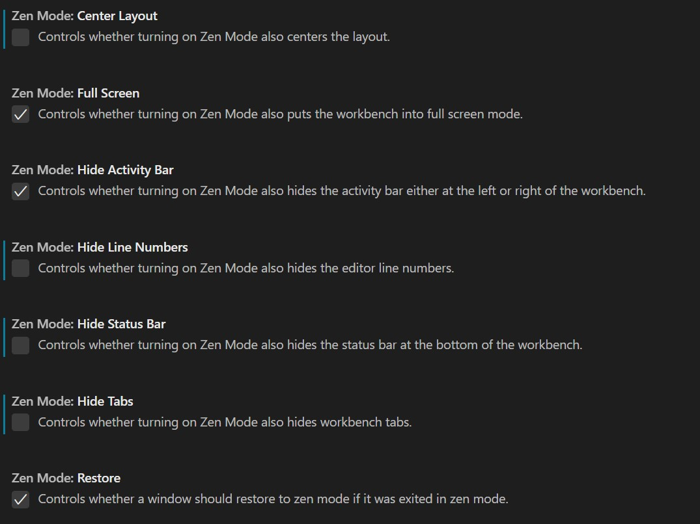
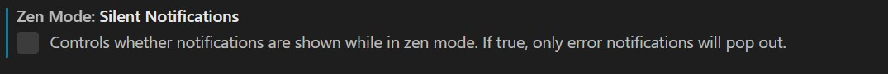

## Configuracion de linea de margen (Rulers)
> Ir a Settings -> rulers -> Edit Rulers

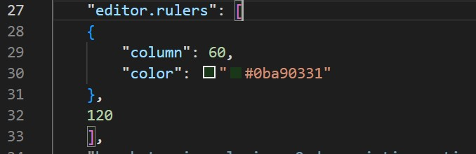

# Kali linux
* [Aprender mas sobre Scripting bash](./pdfReadme/0156-linux-guiones-shell-shell-scripts.pdf)
## Alias para controlador de pantalla de Startech.com
(Manual de configuracion)[https://github.com/AdnanHodzic/displaylink-debian/blob/master/post-install-guide.md]

```bash
# Se configuro en .bashrc
# alias for DisplayLInk StartTech.com
alias aliasdisplay='sudo service displaylink-driver stop && sudo service displaylink-driver start && xrandr --setprovideroutputsource 1 0 && xrandr --setprovideroutputsource 2 0 && xrandr --setprovideroutputsource 3 0 && xrandr --setprovideroutputsource 4 0'
```

## Alias para clonar 
```bash
alias cloneBackendOdyssey2="git clone https://gitlab.com/proyectoBackend"
alias cloneFrontendOdyssey2="git clone https://gitlab.com/proyectoFrontend"
```

## Alias para correr comandos de Angular
```bash
# Se configuro en .bashrc
# alias for NG add manually.
alias ng='~/.npm-global/bin/ng'
```

## Comando de servicios
A veses cuando ciertas cosas no funcionen en Linux, tal ves
es porque el servicio esta apagado o esta fallando por
alguna razon y para eso hay que reiniciar el servicio.

* `systemctl status bluetooth`
* `systemctl stop bluetooth`
* `systemctl start bluetooth`

## Configurar mi terminal en Window [Tutorial](https://www.youtube.com/watch?v=cvK3dlMNGXQ)
* Descargarmos "Terminal" desde PlayStore de Window.
* Descargarmos "Power Shell" desde PlayStore de Window.
* Configuracion de Terminal
    * 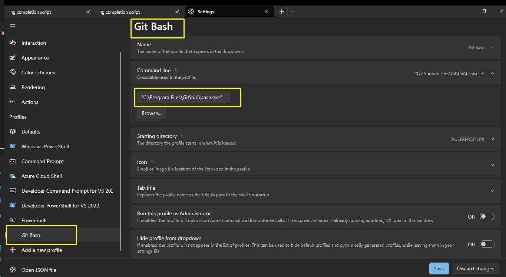
* Instalamos [Oh My Posh para window](https://ohmyposh.dev/) [Vemos la documentacion en la seccion de Instalacion.](https://ohmyposh.dev/docs/installation/windows) 
* Configuramos los [Temas](https://ohmyposh.dev/docs/themes)
    * 
    * Los temas preferidos son los siguientes
        * ```bash
            # El de arriba es el mas favorito con colores subrayados
            eval "$(oh-my-posh init bash --config ~/AppData/Local/Programs/oh-my-posh/themes/hotstick.minimal.omp.json)"
            # eval "$(oh-my-posh init bash --config ~/AppData/Local/Programs/oh-my-posh/themes/gruvbox.omp.json)"
            # eval "$(oh-my-posh init bash --config ~/AppData/Local/Programs/oh-my-posh/themes/tonybaloney.omp.json)"
            # eval "$(oh-my-posh init bash --config ~/AppData/Local/Programs/oh-my-posh/themes/marcduiker.omp.json)"
            # eval "$(oh-my-posh init bash --config ~/AppData/Local/Programs/oh-my-posh/themes/tiwahu.omp.json)"
            # eval "$(oh-my-posh init bash --config ~/AppData/Local/Programs/oh-my-posh/themes/stelbent-compact.minimal.omp.json)"

            # El de arriba es el mas favorito minimalista
            # eval "$(oh-my-posh init bash --config ~/AppData/Local/Programs/oh-my-posh/themes/bubbles.omp.json)"
            # eval "$(oh-my-posh init bash --config ~/AppData/Local/Programs/oh-my-posh/themes/kali.omp.json)"
            # eval "$(oh-my-posh init bash --config ~/AppData/Local/Programs/oh-my-posh/themes/pararussel.omp.json)"
            # eval "$(oh-my-posh init bash --config ~/AppData/Local/Programs/oh-my-posh/themes/robbyrussell.omp.json)"
            # eval "$(oh-my-posh init bash --config ~/AppData/Local/Programs/oh-my-posh/themes/tokyonight_storm.omp.json)"
            # eval "$(oh-my-posh init bash --config ~/AppData/Local/Programs/oh-my-posh/themes/zash.omp.json)"
        ```
* Si llegaramos a notar que los iconos no se ponen bien, significa que hay que instalar fuentes
    * 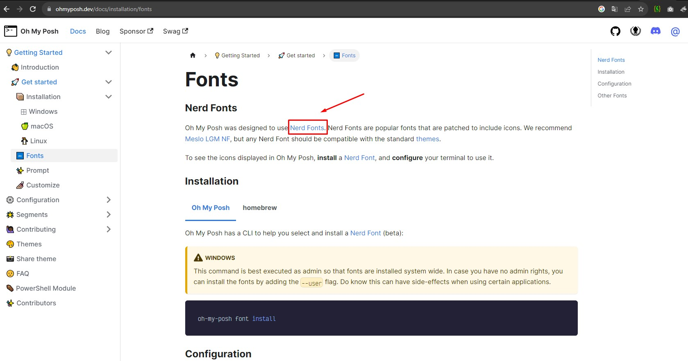
    * Para eso instalo las fuentes de Hack(Es la misma liga que lo de arriba) [En esta liga busco Hack Nerd Font](https://www.nerdfonts.com/font-downloads)
    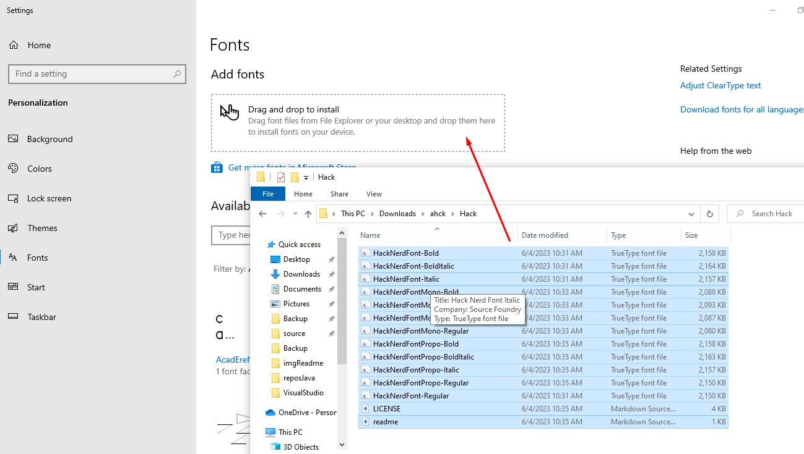
* 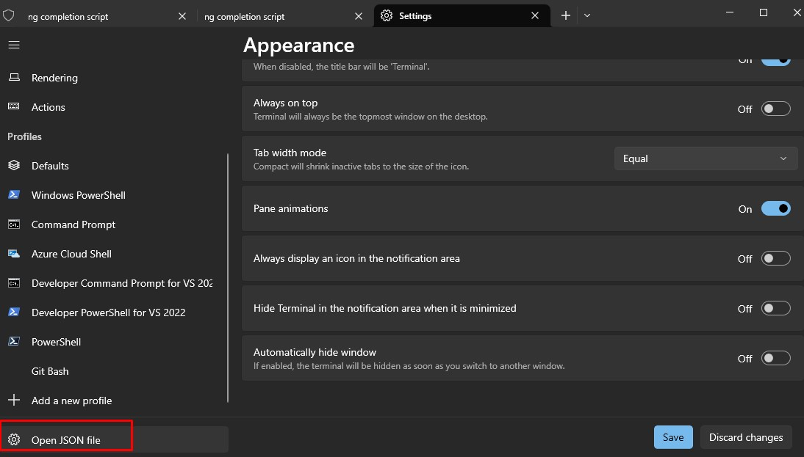
* 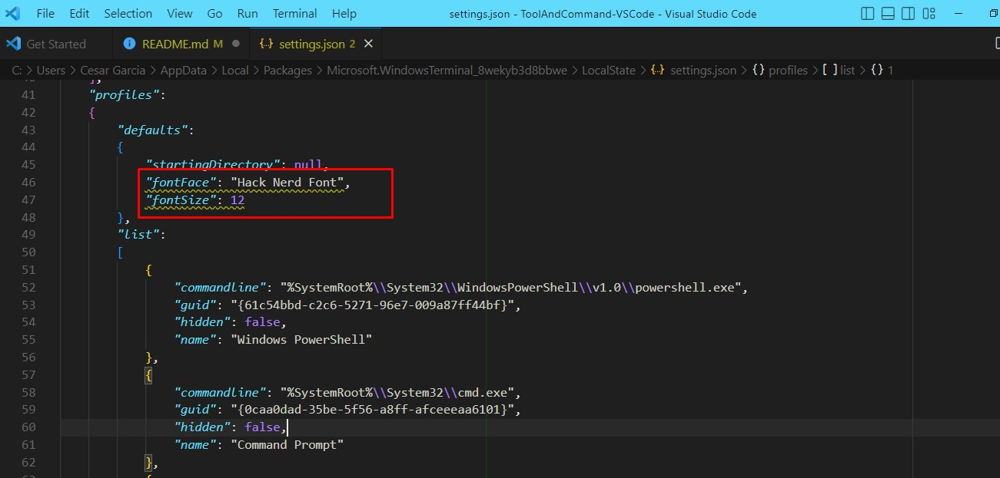
* 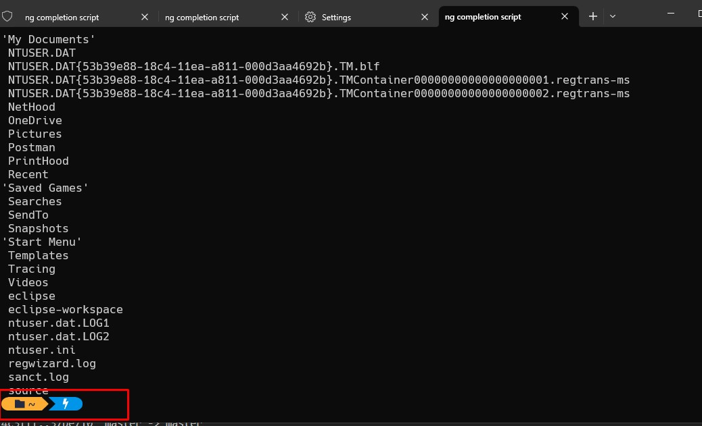
